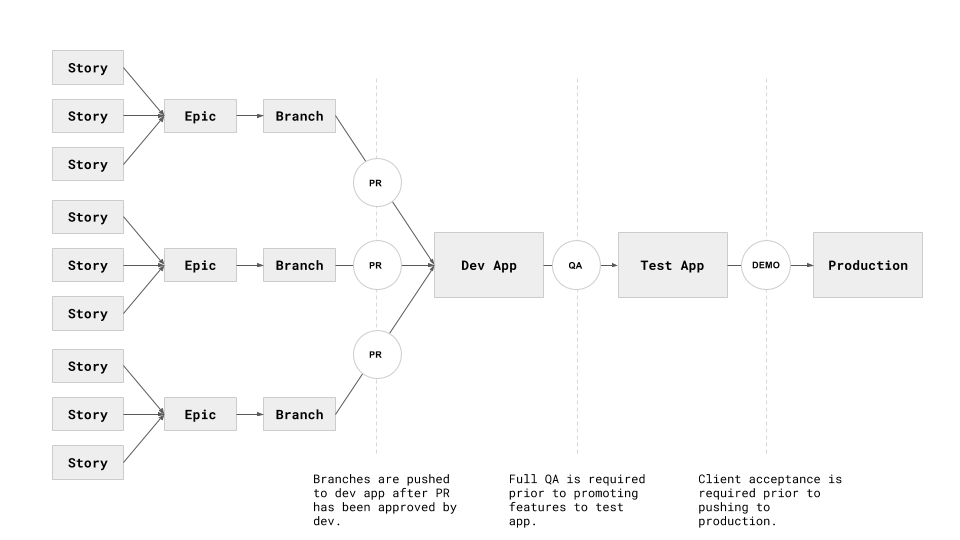

# Workflow

Our process enables development and review on separate branches as well as a multiple environments that allow all stakeholders to preview merged code on dev and test environments prior to deploying to production. 

### Story Creation and Prioritization
In general, a feature moves from concept to production in the following way:

* Based on requirements identified in discover and define phases, concept team produces an idea for a feature
* A feature is added to our preferred project management tool, Pivotal Tracker, as a user story
* Appropriate parties are added to ticket at which time it should be labelled (to correspond to epics) and acceptance criteria must be added. 
* With acceptance criteria added, development can then add estimates to stories. Stories must be estimated before they can be promoted to the backlog.
* Prior to the weekly planning sprint, project management should assess project needs and organize tickets based on priority and what can feasibly be accomplished in that sprint. As a rule, each point should roughly equate to one hour of work and resource should be able to deliver 30 points per-week (allowing time for meetings, emails, administration).
* With a properly organized backlog, no resource should have any confusion around what they should be working on and in what order. 

### Epics, Stories and Tasks

Stories of a uniform theme are grouped around an epic. Epics should be cross-functional, pertaining to both design and development, and focused on a particular piece of functionality. A logical grouping could be:

* User Login (epic)
	* Integrate Design (story)
		* Username (task)
		* Password (task)
		* Submit button (task)
	* Authentication (story)
		* Disallow access for unauthenticated users (task)
	* Error Handling (story)
		* Return meaningful error messages (task)
	
This, in contrast to naming epics based on task at hand and creating too many stories and epics. 

* User Login Design (epic)
	* Username (story)
	* Password (story)
	* Submit button (task)
* User Login Authentication (epic)
	* Disallow access for unauthenticated users (story)
* User Login Error Handling (epic)
	* Return meaningful error messages (story)	
	

### Development Workflow

* Stories are grouped into epics
* Each epic gets its own development branch and preview app
* Once each sprint's commitments have been met for a given epic, a pull request may be issued to merge the branch into the dev site. 
* The PR process is our first line of quality assurance. The q/a team should not test against individual development apps - only the dev environment.
* The dev environment should be up to date and in code freeze at least one working day before sprint demo, allowing q/a enough time to validate tickets. 
* Upon q/a acceptance code is promoted to test
* Upon client review and acceptance, code may be promoted to production

Our preferred hosting platforms are Pantheon and Heroku. Both offer various, useful tools, but as a general rule code moves up and content moves down. At no time should dev content be pushed to production, nor should production code be merged into dev. 

## Versioning
* We use Git for both versioning and deployment. 